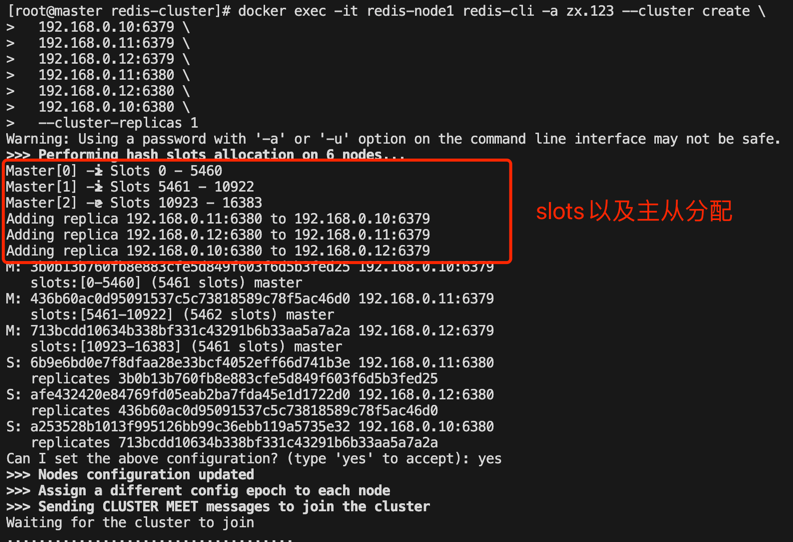

## redis cluster 6x版本部署
这里基于三台服务器node1(192.168.0.10)、node2(192.168.0.11)、node3(192.168.0.12)实现redis cluster(三主三从)部署。
### 1. 目录结构
```
redis-cluster
├── README.md
├── docker-compose.yml
└── redis.conf
```
### 2. 根据情况修改redis配置
常用配置说明
~~~
# redis.conf

requirepass xxx  # 访问密码
cluster-enabled yes  # 开启集群模式
cluster-config-file nodes.conf  # 集群配置文件名
cluster-node-timeout 5000  # 指定集群节点的超时时间（毫秒）。如果一个节点在这个时间内没有响应，它将被认为是不可用的。
cluster-allow-replica-migration yes  # 允许从节点在主节点故障转移后迁移到新的主节点。（从主节点a的从节点，迁移为主节点b的从节点）
cluster-require-full-coverage no  # 如果设置为yes，在集群中任何一个哈希槽不可用时，整个集群将停止工作。设置为no允许集群在部分槽不可用时继续工作。
cluster-replica-no-failover no  # 指定从节点是否允许进行故障转移。设置为yes表示不允许故障转移，no表示允许.(从节点变为主节点)
~~~

### 3. 在三个节点分布部署运行redis实例
```shell
docker-compose up -d
```

### 4. 创建集群
任选一个节点进行集群初始化(最好配置为: 从节点跟主节点不在同一个物理机节点，保证高可用)
```shell
# cluster-replicas 每个主节点的从节点个数; -a后面跟着redis设置的requirepass密码(默认会按照顺序设置主从)
docker exec -it redis-node1 redis-cli -a zx.123 --cluster create \
  192.168.0.10:6379 \
  192.168.0.11:6379 \
  192.168.0.12:6379 \
  192.168.0.11:6380 \
  192.168.0.12:6380 \
  192.168.0.10:6380 \
  --cluster-replicas 1

# 重置集群设置命令
# docker exec -it redis-node1 redis-cli -a zx.123 -c reset

# 手动分配主从关系（从节点跟主节点不在同一个物理机节点，保证高可用）
# 将192.168.0.10:6380作为192.168.0.11:6379的从节点
# docker exec -it redis-node1 redis-cli -a zx.123 --cluster replicate <主节点ID> 192.168.0.11:6380
```



### 5. 验证集群
```shell
docker exec -it redis-node1 redis-cli -a zx.123 -c cluster nodes
docker exec -it redis-node1 redis-cli -a zx.123 -c cluster info
```
